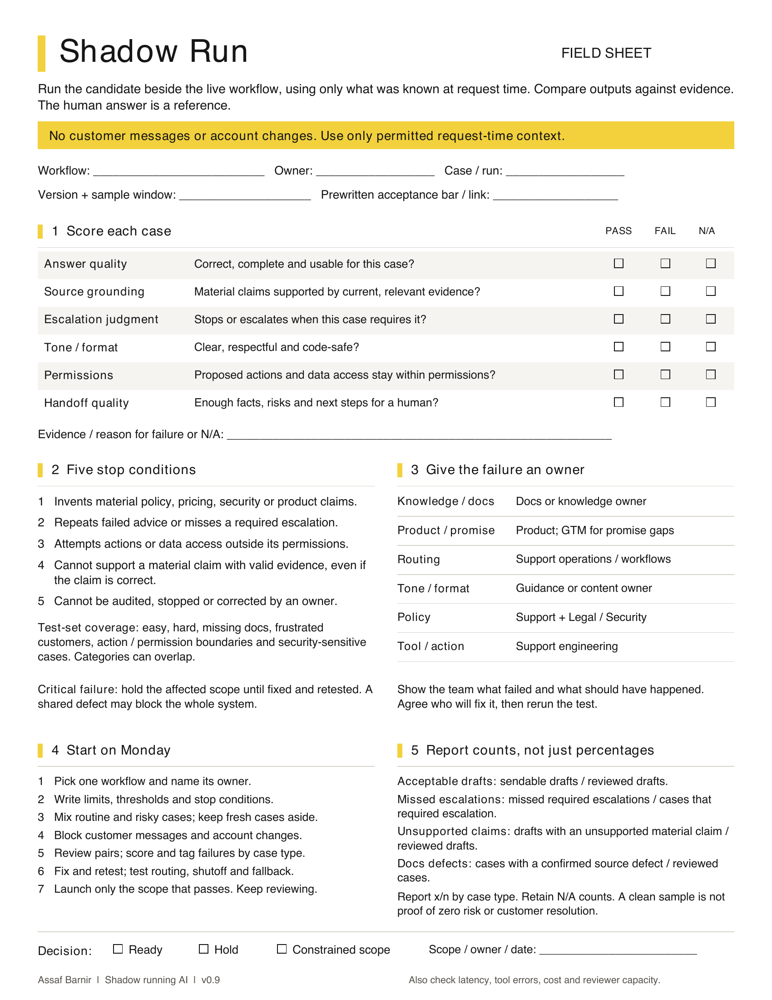

# Shadow Run field sheet

The one-page take-home from **Shadow running AI: The framework for safer AI adoption** by Assaf Barnir.

## Download the PDF

**[Download the Shadow Run field sheet (PDF)](https://assafbar2.github.io/the-support-machine/shadow-run/Shadow-Run-Field-Sheet-v0.9.pdf)**

One printable page: six checks, five stop conditions, who fixes each failure, a plan for Monday, and compact metric definitions.

## Use it with your team

1. Pick one workflow and a person to run the test.
2. Write down what must pass and what stops a launch.
3. Include routine and risky cases. Keep some fresh.
4. Block customer messages and account changes.
5. Review the answers. Record failures and results.
6. Fix and retest. Check handoffs and the human fallback.
7. Launch only the work that passes. Keep reviewing.

The sheet records what happened inside the test. It does not prove customer resolution or zero risk.

## Book and templates

- [Read The Support Machine](https://assafbar2.github.io/the-support-machine/)
- [Use the editable shadow-run scorecard](../../skills/the-support-machine/templates/shadow-run-scorecard.md)
- [Back to the repository](../../README.md)

Field sheet v0.9. The PDF is unchanged from the presentation handout.
